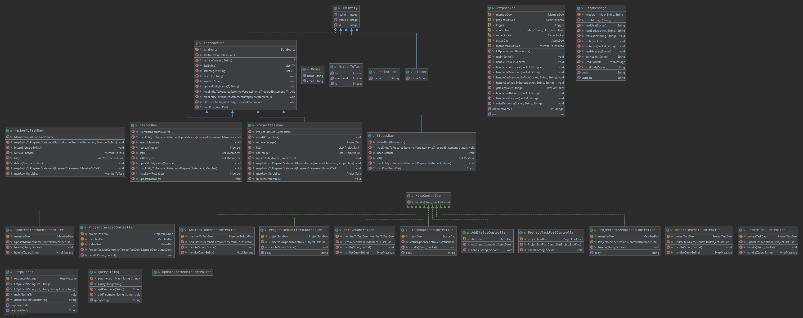

## Bygge, konfigurere og kjøre løsningen

1) Kjør Maven -> Lifecycle -> clean for å fjerne /target. Kjør package deretter for å
bygge prosjektet og opprette .jar fil som kan kjøres 
2) Det må lages en konfigurasjonsfil som heter pgr203.properties, som må inneholde følgende:
``` properties
    dataSource.url=...
    dataSource.username=...
    dataSource.password=...
```

Eksempel:
``` properties
    dataSource.url=jdbc:postgresql://localhost:5432/eksamen
    dataSource.username=eksamen
    dataSource.password=e761@dasu72-234ksja
```

## Designet på løsningen


## Ekstra leveranse utover minimumskravene
- [x] Håndtering av request target "/"
- [x] Avansert datamodell (mer enn 3 tabeller)
- [x] Avansert funksjonalitet (redigering av prosjektmedlemmer, statuskategorier, prosjekter)
- [ ] Implementasjon av cookies for å konstruere sesjoner
- [ ] UML diagram som dokumenterer datamodell og/eller arkitektur (presentert i README.md)
- [x] Rammeverk rundt Http-håndtering (en god HttpMessage class med HttpRequest og HttpResponse subtyper) som gjenspeiler RFC7230
- [x] God bruk av DAO-pattern
- [x] God bruk av Controller-pattern
- [x] Korrekt håndtering av norske tegn i HTTP
- [x] Link til video med god demonstrasjon av ping-pong programmering
- [x] Automatisk rapportering av testdekning i Github Actions
- [ ] Implementasjon av Chunked Transfer Encoding
- [x] Annet


## Egenevaluering